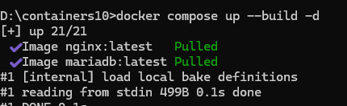

# IWNO10: Управление секретами в контейнерах

## Цель работы
Целью работы является знакомство с методами управления секретами в контейнерах.

## Задание
Создать многосервисное приложение с контейнерами, использующими секреты.

## Настройка

## 1. Исправление docker-compose.yaml

Итоговый базовый файл:

```yaml
services:
  frontend:
    image: nginx:latest
    ports:
      - "80:80"
    volumes:
      - ./site:/var/www/html
      - ./nginx.conf:/etc/nginx/conf.d/default.conf
    networks:
      - frontend

  backend:
    build:
      context: .
      dockerfile: Dockerfile
    environment:
      MYSQL_HOST: database
      MYSQL_DATABASE: my_database
      MYSQL_USER: user
      MYSQL_PASSWORD: userpassword
    networks:
      - backend
      - frontend

  database:
    image: mariadb:latest
    environment:
      MYSQL_ROOT_PASSWORD: rootpassword
      MYSQL_DATABASE: my_database
      MYSQL_USER: user
      MYSQL_PASSWORD: userpassword
    networks:
      - backend
      - frontend

networks:
  frontend: {}
  backend: {}
```

## 2. Изменение класса Database

```php
public function __construct(string $dsn, string $username, string $password)
{
    $this->pdo = new PDO($dsn, $username, $password);
}
```

## 3. Обновление index.php

```php
$dsn = "mysql:host={$config['db']['host']};dbname={$config['db']['database']};charset=utf8";

$db = new Database(
    $dsn,
    $config['db']['username'],
    $config['db']['password']
);
```

## 4. Обновление config.php

```php
$config['db']['host'] = getenv('MYSQL_HOST');
$config['db']['database'] = getenv('MYSQL_DATABASE');
$config['db']['username'] = getenv('MYSQL_USER');
$config['db']['password'] = getenv('MYSQL_PASSWORD');
```

## 5. Обновление Dockerfile

```dockerfile
FROM php:7.4-fpm

RUN apt-get update && \
    apt-get install -y libzip-dev && \
    docker-php-ext-install pdo_mysql

COPY site /var/www/html
```

## 6. Проверка запуска

```bash
docker-compose up --build
```

Проверка:
http://localhost



## 7. Создание секретов

Структура:
```
secrets/
  root_secret
  user
  secret
```

Пример содержимого:

```
root_secret → root123
user        → user
secret      → userpassword
```

## 8. Добавление secrets в docker-compose

```yaml
secrets:
  root_secret:
    file: ./secrets/root_secret
  user:
    file: ./secrets/user
  secret:
    file: ./secrets/secret
```

## 9. Обновление сервиса database

```yaml
database:
  image: mariadb:latest
  environment:
    MYSQL_ROOT_PASSWORD_FILE: /run/secrets/root_secret
    MYSQL_DATABASE: my_database
    MYSQL_USER_FILE: /run/secrets/user
    MYSQL_PASSWORD_FILE: /run/secrets/secret
  secrets:
    - root_secret
    - user
    - secret
  networks:
    - backend
    - frontend
```

## 10. Обновление backend

```yaml
backend:
  build:
    context: .
  environment:
    MYSQL_HOST: database
    MYSQL_DATABASE: my_database
  secrets:
    - user
    - secret
```

## 11. Обновление config.php под secrets

Добавить функцию:

```php
function get_file_contents($path) {
    return trim(file_get_contents($path));
}
```

Заменить:

```php
$config['db']['host'] = getenv('MYSQL_HOST');
$config['db']['database'] = getenv('MYSQL_DATABASE');

// $config['db']['username'] = getenv('MYSQL_USER');
// $config['db']['password'] = getenv('MYSQL_PASSWORD');

$config['db']['username'] = get_file_contents('/run/secrets/user');
$config['db']['password'] = get_file_contents('/run/secrets/secret');
```

## 12. Запуск с секретами

```bash
docker-compose up --build
```

## 13. Проверка безопасности

```bash
docker scout quickview containers10-backend
```

## 14. Минимальная проверка

В контейнере backend:

```bash
docker exec -it <backend_container> sh
cat /run/secrets/user
cat /run/secrets/secret
```

## 15. Результат
backend подключается к БД
пароли не в env
используются /run/secrets/*
контейнер работает